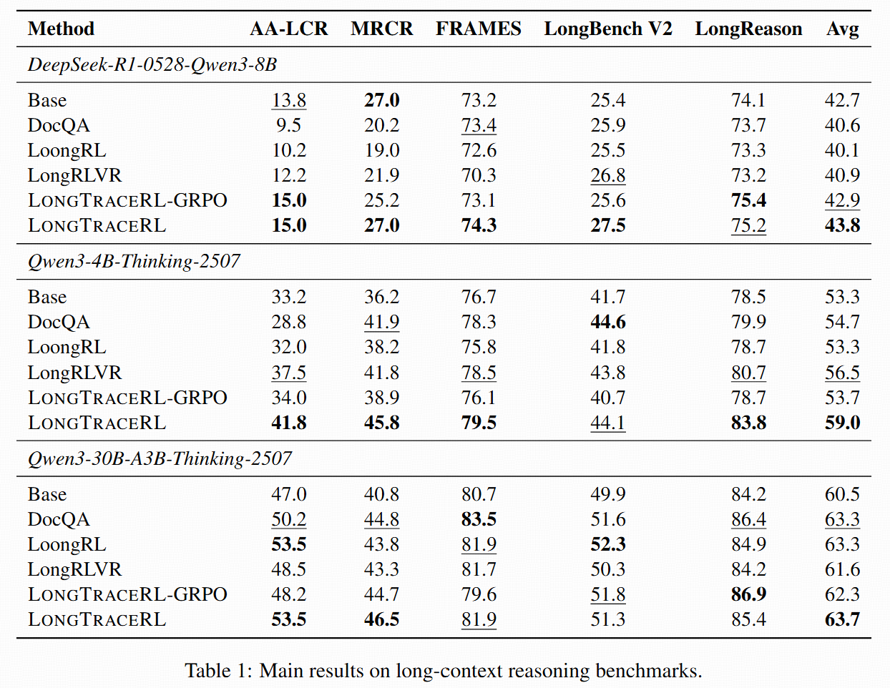

# LongTraceRL: Learning Long-Context Reasoning from Search Agent Trajectories with Rubric Rewards

<div align="center">

[](https://arxiv.org/abs/xxxx.xxxxx)
[](https://huggingface.co/collections/THU-KEG/longtracerl)

*Improving long-context reasoning in LLMs via trajectory-based distractors and entity-level rubric rewards*

</div>


## 🔍 Table of Contents

- [🎯 Overview](#-overview)
- [📈 Results](#-results)
- [📦 Released Models](#-released-models)
- [🚀 Getting Started](#-getting-started)
- [⚙️ Training](#%EF%B8%8F-training)
- [📊 Evaluation](#-evaluation)
- [🙏 Acknowledgments](#-acknowledgments)
- [📚 Citation](#-citation)


## 🎯 Overview

**LongTraceRL** is a reinforcement learning framework for improving long-context reasoning in LLMs. It introduces two key innovations:
- **Trajectory-Based Tiered Distractors**: Multi-hop questions are generated via knowledge graph random walks over Wikipedia, and distractors are derived from real search agent trajectories, organized into high-confusability (Tier-1: read but not cited) and low-confusability (Tier-2: retrieved but never opened) tiers, producing training contexts far more challenging than random or single-search alternatives.
- **Entity-Level Rubric Reward**: Gold entities along each reasoning chain serve as fine-grained process supervision. Combined with a positive-only strategy (rubric credit only for correct answers), this prevents reward hacking and encourages evidence-grounded reasoning.


## 📈 Results

Experiments on three reasoning LLMs (4B to 30B) across five long-context benchmarks:




## 📦 Released Models

| Model | Base Model | HuggingFace |
|-------|------------|-------------|
| **LongTraceRL-4B** | Qwen3-4B-Thinking-2507 | [🤗 Download](https://huggingface.co/THU-KEG/LongTraceRL-4B) |
| **LongTraceRL-8B** | DeepSeek-R1-0528-Qwen3-8B | [🤗 Download](https://huggingface.co/THU-KEG/LongTraceRL-8B) |
| **LongTraceRL-30B** | Qwen3-30B-A3B-Thinking-2507 | [🤗 Download](https://huggingface.co/THU-KEG/LongTraceRL-30B) |


## 🚀 Getting Started

### Prerequisites

- **Hardware**: 4 nodes × 8 GPUs (e.g. H800 80GB) for full 128K context training
- **Software**: Docker with NVIDIA Container Toolkit

### 1. Pull the Docker Image

```bash
docker pull slimerl/slime:v0.2.4
```

Launch a container with GPU access:

```bash
docker run -it --gpus all --shm-size=64g \
    -v /path/to/LongTraceRL:/workspace/LongTraceRL \
    slimerl/slime:v0.2.4 bash
```

### 2. Download Training Data

```bash
huggingface-cli download THU-KEG/LongTraceRL --repo-type dataset --local-dir data/train/
```

This downloads 2,815 long-context QA pairs with rubric annotations.

<details>
<summary>📋 Data Format</summary>

Each training example is a JSON line with the following fields:

| Field | Description |
|-------|-------------|
| `source` | Data source identifier (`"longqa"`) |
| `input_messages` | Chat-format input messages containing the long context and question |
| `label` | Ground truth answer |
| `metadata` | Question metadata including gold entities for rubric reward |

</details>

### 3. Download Base Model

```bash
# Qwen3-4B-Thinking-2507
huggingface-cli download Qwen/Qwen3-4B-Thinking-2507 --local-dir models/hf_models/Qwen3-4B-Thinking-2507

# DeepSeek-R1-0528-Qwen3-8B
huggingface-cli download deepseek-ai/DeepSeek-R1-0528-Qwen3-8B --local-dir models/hf_models/DeepSeek-R1-0528-Qwen3-8B

# Qwen3-30B-A3B-Thinking-2507 (MoE)
huggingface-cli download Qwen/Qwen3-30B-A3B-Thinking-2507 --local-dir models/hf_models/Qwen3-30B-A3B-Thinking-2507
```

### 4. Convert to Torch Distributed Format

Slime uses Megatron-LM for training, which requires converting HuggingFace checkpoints to `torch_dist` format:

```bash
bash scripts/setup/convert_to_torch_dist.sh
```

> **Note**: Edit the script to set `HF_MODEL_PATH`, `OUTPUT_PATH`, and the model config source (`scripts/models/*.sh`) for your target model.

### 5. Launch the Reward Server

The reward server provides outcome reward (LLM-as-judge accuracy) and rubric reward (entity-level score) for training:

```bash
python3 launch_server.py \
    --base_url <YOUR_LLM_API_BASE_URL> \
    --api_key <YOUR_API_KEY> \
    --model_name <JUDGE_MODEL_NAME> \
    --port 7248
```

Then update the `remote_url` in the source config to point to this server:

- `slime/configs/source_config_qwen3_rubric.json` (for Qwen3-based models)
- `slime/configs/source_config_deepseek_r1_distill_rubric.json` (for DeepSeek-R1-distill models)

```json
{
    "longqa": {
        "reward_model": {
            "kwargs": {
                "remote_url": "http://<REWARD_SERVER_IP>:7248/evaluate"
            }
        }
    }
}
```


## ⚙️ Training

```bash
# Qwen3-4B-Thinking-2507
bash scripts/train/train-qwen3-4B-2507.sh

# DeepSeek-R1-0528-Qwen3-8B
bash scripts/train/train-deepseek-r1-0528-qwen3-8B.sh

# Qwen3-30B-A3B-Thinking-2507 (MoE)
bash scripts/train/train-qwen3-30B-A3B-2507.sh
```

### Training Configuration

| Parameter | Value |
|---|---|
| Context length | 128K prompt + 32K response |
| GRPO group size | 8 |
| Global batch size | 128 |
| Training iterations | 200 |
| Learning rate | 2e-6 (constant) |
| Rubric reward weight (η) | 0.3 |
| Rollout temperature | 1.0 |
| Eval temperature | 0.6 |
| Checkpoint interval | Every 20 steps |

Checkpoints and eval results are saved to `outputs/<EXP_TAG>/`.


## 📊 Evaluation

To evaluate a trained checkpoint (or a released model) without training:

```bash
# Qwen3-4B
bash scripts/eval/eval-qwen3-4B-2507.sh

# DeepSeek-R1-0528-Qwen3-8B
bash scripts/eval/eval-deepseek-r1-0528-qwen3-8B.sh

# Qwen3-30B-A3B (MoE)
bash scripts/eval/eval-qwen3-30B-A3B-2507.sh
```

The eval scripts use `--only-eval` mode, which skips training model initialization and runs evaluation directly with SGLang. Edit `HF_MODEL_PATH` in the eval script to point to your checkpoint.

Results are saved to `outputs/<EXP_TAG>/eval_results/`.


## 🙏 Acknowledgments

Training is built on the [Slime](https://github.com/THUDM/slime) RL framework. Questions are generated from the [KILT Wikipedia snapshot](https://github.com/facebookresearch/KILT).


## 📚 Citation

If you find our work useful, please consider citing our paper:

```bibtex

```
